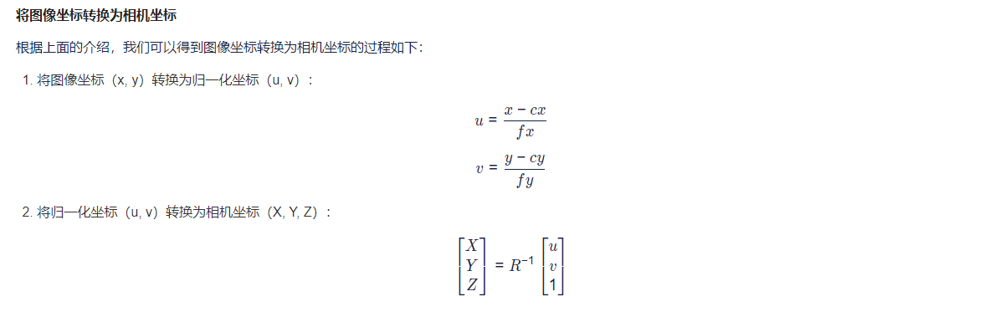

### 在模拟环境中测试和可视化随机交互过程

1. 将形状id更改为其他id以测试其他形状，并将基本动作类型修改为支持的六种类型中的任何一种：推、上推、左推、拉、上拉、左拉。
```bash
python collect_data.py 40147 StorageFurniture 0 pushing
```
2. 运行代码后，将在./results/40147_StorageFurniture_0_pushing_0下找到此交互试验的记录，从中可以看到完整的日志、2D图像、3D深度和交互结果。可以运行以下命令来重放交互。
```bash
python replay_data.py results/40147_StorageFurniture_0_pushing_0/result.json
```


### 生成离线训练数据
1. 在训练网络之前，我们需要使用脚本通过随机探索收集大量交互试验scripts/run_gen_offline_data.sh。默认情况下，此文件会为**pushing**原始操作下的所有类别生成数据。您可以修改上述文件的内容以生成不同设置的数据。
2. 离线数据收集脚本旨在让您通过设置适当的--starting_epoch, --num_epochs, --out_fn 和 --num_processes 参数，在不同机器和许多 CPU 核心上并行生成数据。数据生成后，需要将所有数据移动到同一个文件夹并创建一个ata_tuple_list.txt文件合并所有输出数据索引文件。
```bash
bash scripts/run_gen_offline_data.sh
```

### camera.py中 深度图转点云原理
